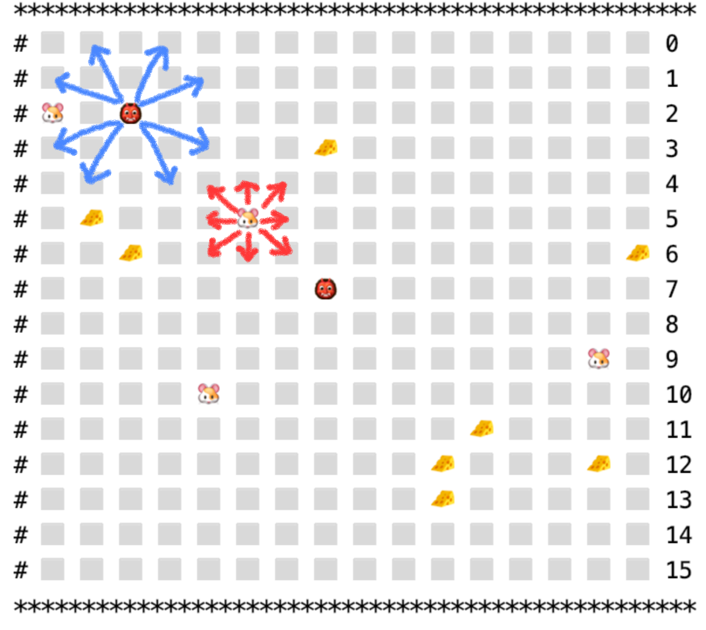

# capture-the-mice
A self-play game showing how smart cat(s) captures the mice!

## Algorihtms
- BFS
- DFS
- IDDFS
- A*

## Rules

The move range and rules for cats and mice are shown as below:

Each mouse always choosing the shortest way to reach the nearest cheese.

The goal of the game is to take the minimal cat steps to capture all the mice before the cheeses are ate up!
